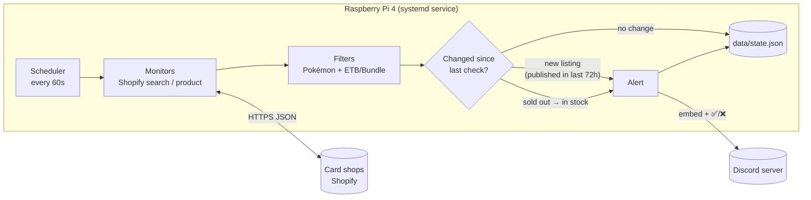

# Pokémon TCG Restock Bot 🚨

A self-hosted Discord bot that watches online card shops for Pokémon TCG **Elite Trainer Boxes** and **Booster Bundles** and posts an alert the moment one is **newly listed** or **comes back in stock**. It runs 24/7 on a Raspberry Pi 4.

Each alert includes the price, a product image, a direct buy link (straight to the cart when the store supports it) and ✅ / ❌ reactions so your server can vote on whether a listing is legit.

---

## ✨ Features

- 🆕 **New-listing alerts:** catches products the moment a store lists them, including preorders
- 🔁 **Restock alerts:** fires when a known listing goes from sold out to available
- 🎯 **Precise filtering:** only Pokémon ETBs and Booster Bundles; single cards, other games and accessories are ignored
- 🛒 **Quick buy links:** Shopify alerts link straight to a cart with the item already in it
- 🗳️ **Community voting:** ✅ / ❌ reactions on every alert
- 📺 **Per-store channels and role pings** (optional)
- 🩺 **Self-monitoring:** warns in Discord if a store keeps failing, and says when it recovers
- 🔄 **Survives restarts:** remembers what it has seen, so a reboot never re-posts old alerts
- ⚙️ **One YAML file** controls which stores, sets and product types are watched

---

## 🧠 How it works



1. **Scheduler** (`bot/scheduler.py`) wakes up every `check_interval_seconds` (default 60) and checks every configured store in parallel.
2. **Monitors** (`monitors/`) ask each store what it has. For Shopify stores the bot uses two public JSON endpoints that every Shopify storefront provides, so no scraping or API key is needed:
   - `/search/suggest.json?q=…` (Shopify's predictive search) returns up to 10 matching products per keyword, with availability and price.
   - `/products/<handle>.js` returns a single product's details, including its publish date.
3. **Filters** (`utils/text.py`) keep only titles that mention Pokémon **and** are an Elite Trainer Box or Booster Bundle. Matching ignores case and accents and matches whole-word starts, so "tin" matches "Tins" but not "Destined".
4. **Change detection** compares each result with `data/state.json`:
   - **New listing:** never seen before. Big stores rotate old listings in and out of the top-10 results, so the bot first checks the product's publish date and only alerts if it went live in the last 72 hours.
   - **Restock:** previously sold out, now available.
   - The first check of any new store or keyword records what's already listed without alerting, so adding a store doesn't flood the channel.
5. **Notifier** (`bot/notifier.py`) posts a Discord embed with the price, image, buy link and store name, then adds ✅ / ❌ reactions.
6. **State** is saved to `data/state.json` after every pass with an atomic write, so a power cut can't corrupt it.

### Reliability

- A **failed check never counts as "out of stock"**, so network errors can't trigger fake "back in stock" alerts.
- **Exponential backoff with jitter** after repeated failures, backing off harder when a site returns HTTP 403 / 429.
- **Polite by design:** at least 2 seconds between requests to the same store, and an honest User-Agent that identifies the bot.
- **Health alerts:** after 5 failed checks in a row the bot posts ⚠️ in Discord, then ✅ when the store recovers.
- **systemd** restarts the bot automatically if it crashes and starts it on boot.

---

## 🧰 Tech stack

| Layer | Technology |
|---|---|
| Language | **Python 3.8+** (3.11 on the Pi; test suite passes on 3.8, 3.13 and 3.14) |
| Discord | **discord.py 2.x**: gateway client, slash commands (`app_commands`), embeds, reactions |
| HTTP | **aiohttp** (async, shared connection pool, per-host rate limiting) |
| Concurrency | **asyncio**: all stores are checked in parallel on one thread |
| Config | **PyYAML** (`config/config.yaml`) + **python-dotenv** (`.env` for secrets) |
| Store data | **Shopify Ajax API** (predictive search + product JSON); **Best Buy Products API** (optional) |
| Persistence | JSON file (`data/state.json`) with atomic writes |
| Tests | **pytest**: unit tests plus a real local aiohttp test server for HTTP behavior |
| Process manager | **systemd** service on Raspberry Pi OS |

No database, browser automation or paid services. The whole bot is about 1,000 lines of Python, plus about 600 lines of tests.

---

## 🖥️ Hardware

| | |
|---|---|
| **Board** | Raspberry Pi 4 Model B, **8 GB RAM** |
| **OS** | Raspberry Pi OS (Debian 12 "Bookworm"), 64-bit (`aarch64`) |
| **Python** | 3.11 (ships with Bookworm) |
| **Network** | Home Wi-Fi / Ethernet (outbound HTTPS only, no ports opened) |
| **Runs as** | systemd service `restock-bot`, starts on boot |

The bot is lightweight: one Python process, mostly idle while it waits between checks. Any Pi 3/4/5, or any always-on Linux, macOS or Windows machine, will run it fine. 8 GB leaves plenty of room for other projects on the same Pi.

> 💡 Give the Pi a **DHCP reservation** in your router so its IP address never changes, which makes SSH easy.

---

## 📁 Project structure

```text
pokemon-restock-bot/
├─ main.py               # Entry point: loads config, starts the bot
├─ bot/
│  ├─ client.py          # Discord client, slash-command sync, alert routing
│  ├─ commands.py        # /status, /checknow, /testalert
│  ├─ notifier.py        # Alert embed layout + ✅/❌ reactions
│  └─ scheduler.py       # Polling loop, change detection, backoff, health alerts
├─ monitors/
│  ├─ __init__.py        # Registry: retailer name → check function
│  ├─ http.py            # Shared aiohttp client (rate limiting, error handling)
│  ├─ errors.py          # CheckFailed / Blocked exceptions
│  ├─ shopify.py         # Shopify search + product monitors
│  ├─ bestbuy.py         # Best Buy Products API monitor (needs API key)
│  └─ demo.py            # Fake monitor for testing the pipeline
├─ utils/
│  ├─ config.py          # Loads config.yaml + .env into typed settings
│  ├─ state.py           # Reads/writes data/state.json atomically
│  └─ text.py            # Accent-insensitive title matching
├─ config/config.yaml    # What to watch (stores, keywords, filters, channels)
├─ data/state.json       # Runtime memory (git-ignored)
├─ tests/                # pytest suite
├─ .env.example          # Template for secrets (copy to .env)
└─ requirements.txt
```

---

## ⚙️ Setup (any machine)

```bash
git clone https://github.com/alexjowilson/pokemon-restock-bot.git
cd pokemon-restock-bot
python3 -m venv venv
source venv/bin/activate
pip install -r requirements.txt
cp .env.example .env
```

1. **Create a Discord bot** at <https://discord.com/developers/applications>. Copy the **Application ID** into `APP_ID` and the bot **Token** (Bot tab → Reset Token) into `DISCORD_TOKEN` in `.env`. The Public Key isn't needed.
2. **Invite the bot** to your server with permissions to View Channel, Send Messages, Embed Links, Add Reactions and Read Message History.
3. **Get IDs:** in Discord, turn on Settings → Advanced → **Developer Mode**. Right-click your alerts channel → **Copy Channel ID** → `ALERT_CHANNEL_ID` in `.env`. Right-click your server icon → **Copy Server ID** → `GUILD_ID`, which makes slash commands appear instantly.
4. Run it:
   ```bash
   python main.py
   ```
5. In Discord, run `/checknow` to see what the bot finds.

---

## 🍓 Deploying on the Raspberry Pi

On the Pi:

```bash
sudo apt update && sudo apt install -y git python3-venv
git clone https://github.com/alexjowilson/pokemon-restock-bot.git ~/Developer/pokemon-restock-bot
cd ~/Developer/pokemon-restock-bot
python3 -m venv venv
venv/bin/pip install -r requirements.txt
mkdir -p data
```

From your computer, copy the files that aren't in git:

```bash
scp .env <user>@<pi-address>:~/Developer/pokemon-restock-bot/
scp data/state.json <user>@<pi-address>:~/Developer/pokemon-restock-bot/data/   # optional: keeps history
```

Install it as a service (on the Pi):

```bash
sudo tee /etc/systemd/system/restock-bot.service > /dev/null <<EOF
[Unit]
Description=Pokemon restock Discord bot
After=network-online.target
Wants=network-online.target

[Service]
User=$USER
WorkingDirectory=$HOME/Developer/pokemon-restock-bot
ExecStart=$HOME/Developer/pokemon-restock-bot/venv/bin/python main.py
Restart=always
RestartSec=10

[Install]
WantedBy=multi-user.target
EOF
sudo systemctl daemon-reload
sudo systemctl enable --now restock-bot
```

> ⚠️ Run the bot in **one place only**. Two copies with the same token double-post every alert.

### Day-to-day commands (on the Pi)

| Task | Command |
|---|---|
| Live logs | `journalctl -u restock-bot -f` |
| Last 30 log lines | `journalctl -u restock-bot -n 30 --no-pager` |
| Status | `systemctl status restock-bot --no-pager` |
| Restart | `sudo systemctl restart restock-bot` |
| Deploy an update | `git pull && sudo systemctl restart restock-bot` |

**Workflow:** edit `config/config.yaml` on your computer → commit and push → on the Pi, `git pull` and restart → `/checknow` in Discord.

---

## 🛠️ Configuration (`config/config.yaml`)

```yaml
check_interval_seconds: 60

discord:
  alert_channel_id: 0        # or ALERT_CHANNEL_ID in .env
  vote_reactions: true       # ✅/❌ under each alert

searches:
  - id: "zulus_games"                       # keep ids stable; saved history uses them
    store_name: "Zulu's Games"
    store_url: "https://zulusgames.com"
    channel_id: 0                           # optional: this store's own channel (0 = default)
    queries:                                # each returns up to 10 matches; be specific
      - "30th celebration elite trainer box"
      - "30th celebration booster bundle"
    require_all: ["pokemon"]                # title must contain all of these
    include_any: ["elite trainer box", "etb", "booster bundle"]   # ...and one of these
    exclude: ["sleeve", "playmat"]          # ...and none of these
    # new_listing_max_age_hours: 72
```

The real config uses YAML anchors (`&pokemon_queries` / `*pokemon_queries`) so every store shares one keyword list.

### Adding a store

1. Open any product page on the shop and add **`.js`** to the end of the URL. If you see a page of JSON text, it's a Shopify store and will work.
2. Copy an existing block under `searches:` and give it a new `id`, `store_name` and `store_url`.
3. Commit, deploy, and run `/checknow`.

### Single product pages (optional)

To watch one specific page instead of a search, add it under `products:` with `retailer: "shopify"` and its `url` (or `retailer: "bestbuy"` with a `sku`).

### Environment variables (`.env`)

| Variable | Required | Purpose |
|---|---|---|
| `DISCORD_TOKEN` | ✅ | Bot token (secret) |
| `APP_ID` | ✅ | Discord Application ID |
| `ALERT_CHANNEL_ID` | ✅* | Default alerts channel (*or set in config.yaml) |
| `GUILD_ID` | | Your server ID; makes slash commands appear instantly |
| `HEALTH_CHANNEL_ID` | | Private channel for ⚠️ failure warnings |
| `ALERT_ROLE_ID` | | Role to @mention on alerts |
| `BESTBUY_API_KEY` | | Only for the Best Buy monitor |

---

## 💬 Slash commands

| Command | What it does |
|---|---|
| `/status` | What's being watched, when each store was last checked, and any failing stores |
| `/checknow` | Checks every store right now and lists results, with in-stock items as clickable links. Doesn't send alerts. |
| `/testalert` | Posts a sample alert to check the channel and permissions |

---

## 🏪 Retailer support

| Retailer | Status | Notes |
|---|---|---|
| **Shopify card shops** | ✅ Supported | Public JSON endpoints; no key needed |
| **Best Buy** | 🟡 Built, needs a key | Official Products API; keys require a company email |
| **Target** | 🔜 Possible | Unofficial endpoint; not built yet |
| **Amazon** | 🟡 Possible | Needs an Amazon Associates account (Creators API) |
| **Walmart / Costco / Pokémon Center** | ❌ Not supported | No public API and active bot protection; this project doesn't try to get around it |

**Adding a retailer:** write `monitors/<name>.py` with `async def check_product(product: dict) -> dict` returning `{"in_stock": bool, "price": ..., "image_url": ..., "cart_url": ...}`. Fetch with `monitors.http.http.get_json`, raise `monitors.errors.CheckFailed` on failure, and register it in `MONITORS`.

---

## 🧪 Tests

```bash
pip install pytest
pytest
```

The suite covers alert de-duplication, restock and new-listing detection, the per-keyword quiet first check, backoff and health alerts, title filtering, Shopify and Best Buy response parsing, the alert layout, and HTTP status handling against a real local server.

---

## 🚧 Roadmap

- [x] Slash commands (`/status`, `/checknow`, `/testalert`)
- [x] Polling loop with de-duplicated alerts
- [x] Shopify search monitor: new listings + restocks
- [x] Sealed-product filtering and publish-date check
- [x] Backoff, per-host rate limiting, health alerts
- [x] ✅/❌ voting, per-store channels and role pings
- [x] systemd deployment on Raspberry Pi 4
- [ ] Watchdog (e.g. healthchecks.io) to alert if the Pi itself goes offline
- [ ] Target monitor
- [ ] `/watch add` / `/watch remove` commands
- [ ] Set-name filter

---

## ⚠️ Disclaimer

This project is for educational and personal use only. It reads public product data at a gentle rate and does not bypass CAPTCHAs, queues or other bot protection. Retailer websites may have terms of service regarding automated access.

Pokémon and Pokémon TCG are trademarks of Nintendo, Creatures, and GAME FREAK.
